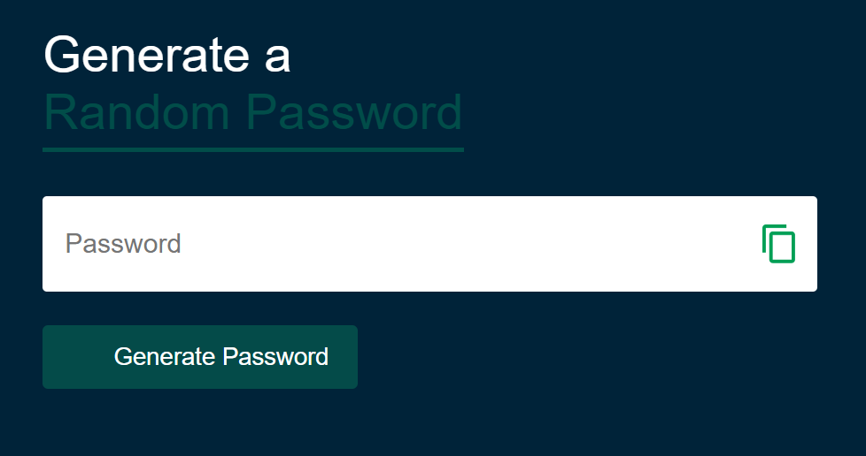
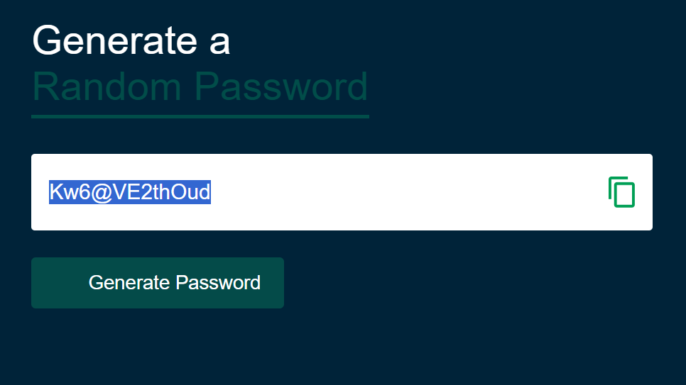

# Password Generator  

A lightweight, responsive password generator that creates secure, random passwords based on user‑selected criteria.  
This tool is ideal for anyone who needs strong passwords for online accounts, development environments, or security‑focused workflows. It solves the common problem of weak or reused passwords by generating unique, high‑entropy strings instantly.

Live Demo: *(Add your GitHub Pages link here)*  
Frontend Repo: [https://github.com/STEM-Girlie/Password-Generator](https://github.com/STEM-Girlie/Password-Generator)  
Backend Repo: *(Not applicable — this is a frontend‑only project)*  

## Table of Contents

- [Overview](#overview)
- [Features](#features)
- [Tech Stack](#tech-stack)
- [Architecture](#architecture)
- [Database Design](#database-design)
- [API Endpoints](#api-endpoints)
- [Installation](#installation)
- [Environment Variables](#environment-variables)
- [Usage](#usage)
- [Screenshots](#screenshots)
- [Deployment](#deployment)
- [Future Improvements](#future-improvements)
- [Credits](#credits)
- [License](#license)

## Overview

### Motivation
This project was built to strengthen your JavaScript fundamentals while creating a practical tool that supports good security habits.  
It also serves as a portfolio piece demonstrating your ability to build interactive UI components and handle dynamic logic.

### Objective
To provide users with a fast, simple way to generate secure passwords using customizable options such as length, numbers, symbols, and uppercase/lowercase letters.

### Learning Outcomes
- Practiced DOM manipulation and event handling  
- Implemented dynamic password generation logic  
- Designed a clean, responsive UI  
- Improved understanding of randomness and character sets  
- Deployed a static front‑end application  

## Features

- Generate secure, random passwords  
- Adjustable password length  
- Toggle options for:
  - Uppercase letters  
  - Lowercase letters  
  - Numbers  
  - Symbols  
- One‑click copy to clipboard  
- Fully responsive design  

## Tech Stack

### Frontend
- HTML5  
- CSS3  
- JavaScript (Vanilla)

### Backend
*(Not applicable — this is a frontend‑only project)*

### Database
*(Not applicable — no database used)*

### Tools
- Git & GitHub  
- VS Code  
- GitHub Pages (Deployment)

## Architecture

Client (Browser)  
↓  
JavaScript Logic (Password Generation + UI Updates)  
↓  
Rendered Password Output  

Folder Structure Example:

```
Password-Generator/
 ├── index.html
 ├── style.css
 ├── script.js
 └── assets/
       └── screenshots
```

## Database Design

This project does not use a database.  
All password generation happens client‑side in JavaScript.

## API Endpoints

This project does not include a backend or API.

## Installation

### Clone the Repository

```bash
git clone https://github.com/STEM-Girlie/Password-Generator.git
cd Password-Generator
```

No dependencies are required — this is a pure front‑end project.

## Usage

1. Open `index.html` in your browser  
2. Select your desired password length  
3. Choose which character types to include  
4. Click **Generate Password**  
5. Click **Copy** to copy the password to your clipboard  

## Screenshots

```
assets/
 ├── home.png
 └── randompassword.png
```






## Deployment

To deploy using GitHub Pages:

1. Go to **Settings** → **Pages**  
2. Select branch: `main`  
3. Folder: `/root`  
4. Save  

Your site will be live in seconds.

## Future Improvements

- Add strength meter (weak / medium / strong)  
- Add option to avoid ambiguous characters (e.g., O/0, l/1)  
- Add dark mode  
- Add ability to generate multiple passwords at once  
- Add API integration for password breach checking (e.g., HaveIBeenPwned)  
- Add cloud‑themed UI or refactor into a **Cloud Security Password Tool**  

## Credits

Developer: **Nasreen Baker**  
GitHub: `https://github.com/STEM-Girlie` [(github.com in Bing)](https://www.bing.com/search?q="https%3A%2F%2Fgithub.com%2FSTEM-Girlie")  

## License

This project is licensed under the MIT License.
